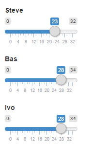

What if analysis for project management
========================================================
author: Steve de Peijper
date: 

Background
========================================================

Are you a project manager and do you question what would happen when;

  A resource would spend more or less time on projects, considering;
  
- The project priorities for each resource
- The ratio of time spent for projects with equal priority
- The productivity for resources for specific projects
- Fixed projects that require hours spent regardless of the paramaters

Presentation
========================================================

The shiny application I built will render a new gantt chart whenever one of the tuning parameters changes. The tuning parameter is the amount of hours a resource can spend on projects. 



Slide With Code
========================================================


```r
summary(cars)
```

```
     speed           dist       
 Min.   : 4.0   Min.   :  2.00  
 1st Qu.:12.0   1st Qu.: 26.00  
 Median :15.0   Median : 36.00  
 Mean   :15.4   Mean   : 42.98  
 3rd Qu.:19.0   3rd Qu.: 56.00  
 Max.   :25.0   Max.   :120.00  
```

Slide With Plot
========================================================


